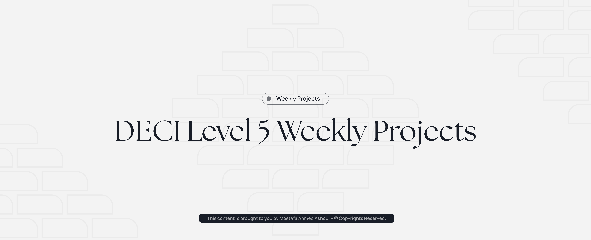

# DECI Level 5 Weekly Projects Repository

## 👋 About
This repository contains all my projects completed during the DECI level 5 program.

**Name:** Mostafa Ahmed Ashour  
**Track:** Web development

---

## 📂 Projects

Each folder represents a separate project.

- `/second` → (CI CD with github actions and CodeCov)
- `/fourth` → (Docker compose and mulit-services)

---

## 🚀 How to Run a Project

1. Navigate to the project folder:
   ```bash
   cd week (first, second, third...)